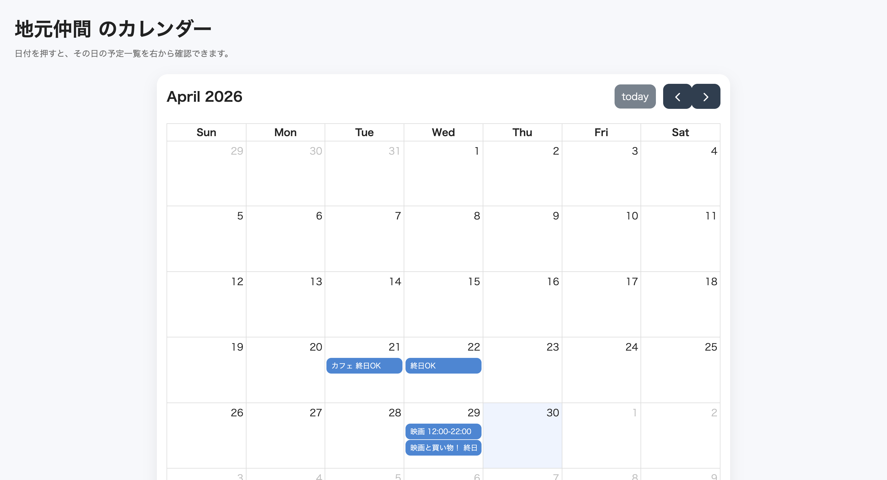
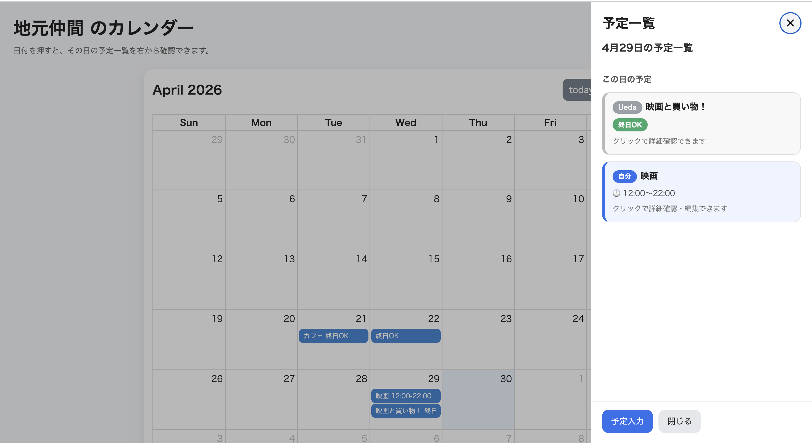
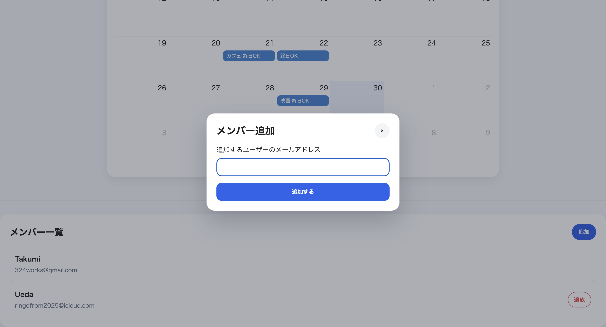
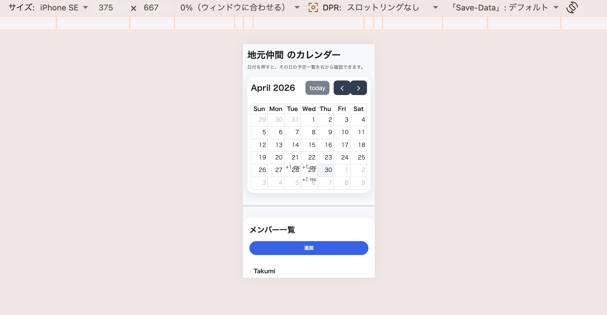

# 🗓️ Schedule Calendar App

## 📌 概要

グループ単位で予定を共有できるカレンダーアプリです。  
ログインユーザーがグループを作成し、メンバーと予定を管理できます。

予定はカレンダー上で確認でき、日付ごとに予定の作成・確認ができます。  
複数人で予定を共有することを想定し、グループ機能・メンバー追加機能・ログインユーザーごとの権限制御を実装しました。

---

## 🔗 デモ

https://schedule-calendar-1.onrender.com

※Renderの無料枠を使用しているため、初回アクセス時に表示まで30秒〜1分ほどかかる場合があります。

## 🔐 デモ用アカウント

動作確認用のデモアカウントを用意しています。

メインアカウント  
メールアドレス：test@example.com  
パスワード：DemoPass2026

サブアカウント  
メールアドレス：member@example.com  
パスワード：SamplePass2026

※サブアカウントで登録した予定は、メインアカウントから編集・削除できないように権限制御しています。

---

## 🛠 使用技術

- PHP 8.x
- Laravel 12
- PostgreSQL
- Blade
- JavaScript
- FullCalendar
- Docker
- Render

---

## ✨ 機能一覧

### 👤 認証機能

- ユーザー登録
- ログイン
- ログアウト

### 👥 グループ機能

- グループ作成
- グループ一覧表示
- グループ詳細表示
- メンバー追加（メール指定）
- メンバー削除

### 📅 カレンダー機能

- 月表示カレンダー（FullCalendar）
- 日付クリックによる予定入力
- 日付ごとの予定一覧表示
- モバイル表示対応

### 📝 予定管理機能

- 予定の作成
- 予定の一覧表示
- 予定の編集
- 予定の削除
- 終日予定の登録
- 開始時間・終了時間の登録
- 自分の予定のみ編集・削除可能

---

## 🧩 工夫した点

- FullCalendarを使用し、予定を直感的に確認できるUIを実装
- 予定入力をサイドバー形式にし、カレンダー画面から離れずに操作できるようにした
- スマートフォンでも操作しやすいように、モバイル表示を意識してレイアウトを調整
- グループ機能を実装し、複数人で予定を共有できる構成にした
- メールアドレス指定によるメンバー追加機能を実装
- ログインユーザーによる権限制御を行い、自分の予定のみ編集・削除できるようにした
- Render + Docker によるデプロイを行い、Web上でアプリを確認できるようにした
- PostgreSQLを使用し、ユーザー・グループ・予定データを永続化できるようにした

---

## 🗄 データベースについて

開発環境ではローカルDBを使用し、本番環境ではRenderのPostgreSQLを使用しています。  
ユーザー情報、グループ情報、予定情報、グループメンバー情報を保存し、デプロイ後もデータが保持されるようにしています。

---

## 🚧 今後の改善予定

- 招待URL機能の実装
- 通知機能（リマインド）
- 予定の検索機能
- カレンダー表示のさらなるUI改善
- メンバー権限の細分化
- デザインのブラッシュアップ

---

## 📸 画面イメージ

### カレンダー画面

### 予定入力サイドバー

### グループ一覧

### メンバー追加

### モバイル画面

